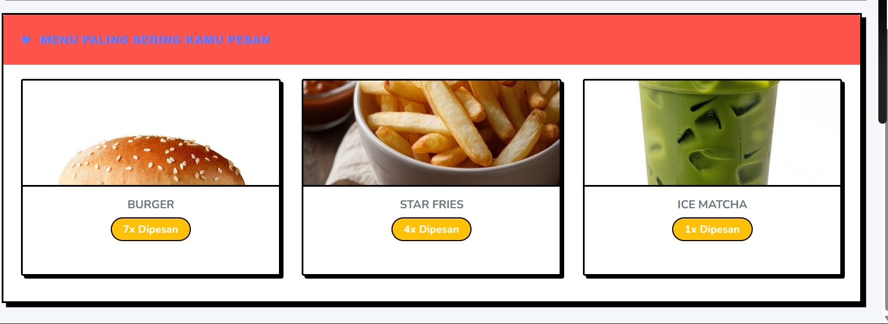

<div align="center">

# ☕ KISEE COFFEE

### 🚀 Sistem Manajemen Coffee Shop Modern Berbasis Web

[](https://www.php.net/)
[](https://codeigniter.com/)
[](https://www.mysql.com/)
[](LICENSE)



Sistem manajemen coffee shop berbasis web yang dirancang untuk mempermudah operasional cafe dan kedai kopi menggunakan CodeIgniter 3.

Fitur • Instalasi • Penggunaan • Teknologi • Kontribusi

</div>

---

## Tentang Project

Kisee Coffee adalah aplikasi manajemen coffee shop berbasis web yang dibuat untuk membantu pengelolaan pesanan, produk, transaksi, dan pengguna dalam satu sistem terintegrasi. Project ini cocok digunakan untuk cafe skala kecil hingga menengah yang membutuhkan sistem yang sederhana, cepat, dan mudah dikembangkan.

## Fitur Utama

### Manajemen Pesanan

-   Proses pesanan secara real-time
-   Menu makanan dan minuman berdasarkan kategori
-   Sistem keranjang belanja
-   Riwayat pesanan pengguna

### Manajemen Pengguna

-   Sistem login dan registrasi
-   Autentikasi pengguna yang aman
-   Manajemen profil
-   Hak akses berdasarkan role

### Manajemen Produk

-   Tambah, ubah, dan hapus menu
-   Pengelompokan kategori produk
-   Upload gambar produk
-   Pengaturan harga

### Sistem Transaksi

-   Pencatatan transaksi pembayaran
-   Riwayat transaksi
-   Status pembayaran
-   Bukti pembayaran

### Dashboard dan Laporan

-   Dashboard admin
-   Laporan penjualan
-   Statistik pengguna
-   Ringkasan stok dan produk

### Notifikasi

-   Notifikasi status pesanan
-   Informasi sistem
-   Update real-time

### Fitur Tambahan

-   Mode gelap
-   Tampilan responsif
-   Integrasi OCR Scanner
-   Script perbaikan database otomatis

## Teknologi yang Digunakan

| Teknologi     | Kegunaan             |
| ------------- | -------------------- |
| CodeIgniter 3 | Framework backend    |
| PHP 7.3+      | Bahasa pemrograman   |
| MySQL         | Database             |
| JavaScript    | Interaksi frontend   |
| CSS3          | Tampilan dan styling |
| Composer      | Manajemen dependency |

## Prasyarat

Pastikan sudah terpasang:

-   XAMPP atau sejenisnya

    -   PHP minimal versi 7.3
    -   MySQL minimal versi 8.0
    -   Apache

-   Composer
-   Git

## Cara Instalasi

### 1. Clone Repository

```bash
git clone https://github.com/FikriBintangx/KISEECOFFE.git
cd KISEECOFFE
```

### 2. Install Dependency

```bash
composer install
```

### 3. Setup Database

Buat database baru melalui phpMyAdmin:

```sql
CREATE DATABASE kiisecoffee;
```

Import database:

```bash
mysql -u root -p kiisecoffee < kiisecoffee.sql
mysql -u root -p kiisecoffee < fix_database.sql
```

### 4. Konfigurasi Database

Edit file application/config/database.php

```php
$db['default'] = array(
    'hostname' => 'localhost',
    'username' => 'root',
    'password' => '',
    'database' => 'kiisecoffee',
    'dbdriver' => 'mysqli'
);
```

### 5. Konfigurasi Base URL

Edit application/config/config.php

```php
$config['base_url'] = 'http://localhost/KiiseCoffee/';
```

### 6. Permission Folder

Linux / Mac:

```bash
chmod -R 755 application/cache
chmod -R 755 application/logs
```

Windows:
Pastikan folder cache dan logs tidak dalam mode read-only.

### 7. Jalankan Aplikasi

1. Nyalakan Apache dan MySQL
2. Buka browser dan akses:

```
http://localhost/KiiseCoffee/
```

## Cara Penggunaan

### Untuk Pengguna

1. Registrasi atau login
2. Pilih menu
3. Tambahkan ke keranjang
4. Checkout pesanan
5. Pantau status pesanan

### Untuk Admin

1. Login ke panel admin
2. Kelola produk
3. Proses pesanan
4. Lihat laporan penjualan
5. Kelola akun pengguna

## Struktur Project

```
KiiseCoffee/
├── application/
│   ├── controllers/
│   ├── models/
│   ├── views/
│   ├── libraries/
│   └── config/
├── assets/
│   ├── css/
│   ├── js/
│   └── img/
├── system/
├── vendor/
└── index.php
```

## Controller Penting

-   Auth.php untuk autentikasi
-   Home.php untuk halaman utama
-   Makanan.php untuk manajemen produk
-   Notification.php untuk notifikasi
-   Dbfix.php untuk utilitas database

## Screenshot

Homepage


Screenshot tambahan akan menyusul.

## Kontribusi

Kontribusi sangat terbuka:

1. Fork repository
2. Buat branch baru
3. Commit perubahan
4. Push ke branch
5. Ajukan pull request

## Lisensi

Project ini menggunakan lisensi MIT. Silakan lihat file license.txt untuk detail.

## Author

Fikri Bintang
GitHub: [https://github.com/FikriBintangx](https://github.com/FikriBintangx)
Repository: [https://github.com/FikriBintangx/KISEECOFFE](https://github.com/FikriBintangx/KISEECOFFE)

## Dukungan

Jika menemukan bug atau kendala:

1. Cek halaman Issues
2. Buat issue baru jika belum ada
3. Sertakan penjelasan yang jelas

---

<div align="center">

⭐ Jangan lupa beri star jika project ini bermanfaat

Dibuat dengan kopi dan logika oleh Fikri Bintang

</div>

link github : https://github.com/FikriBintangx/KISEECOFFE
link youtube : https://youtu.be/bN84lHcdTaM
